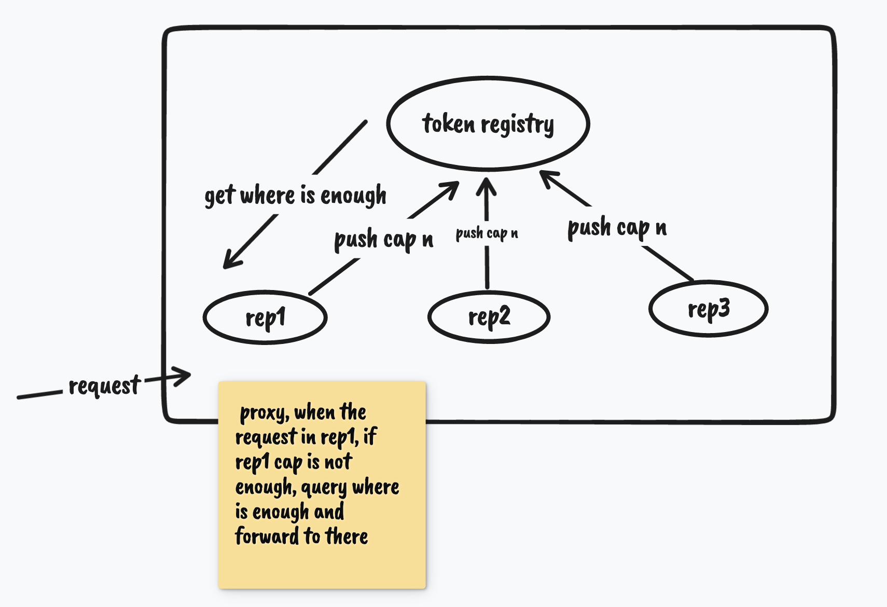

  

      <pre style="float:center">
 _  .-')      ('-.      .-') _       ('-.                         _   .-')               .-') _    
( \( -O )    ( OO ).-. (  OO) )    _(  OO)                       ( '.( OO )_            (  OO) )   
 ,------.    / . --. / /     '._  (,------.  ,--.        ,-.-')   ,--.   ,--.)  ,-.-')  /     '._  
 |   /`. '   | \-.  \  |'--...__)  |  .---'  |  |.-')    |  |OO)  |   `.'   |   |  |OO) |'--...__) 
 |  /  | | .-'-'  |  | '--.  .--'  |  |      |  | OO )   |  |  \  |         |   |  |  \ '--.  .--' 
 |  |_.' |  \| |_.'  |    |  |    (|  '--.   |  |`-' |   |  |(_/  |  |'.'|  |   |  |(_/    |  |    
 |  .  '.'   |  .-.  |    |  |     |  .--'  (|  '---.'  ,|  |_.'  |  |   |  |  ,|  |_.'    |  |    
 |  |\  \    |  | |  |    |  |     |  `---.  |      |  (_|  |     |  |   |  | (_|  |       |  |    
 `--' '--'   `--' `--'    `--'     `------'  `------'    `--'     `--'   `--'   `--'       `--'    
  </pre>
  

  

  

# Usage

- 固定窗口计数器
- 滑动窗口计数器
- ✅ 漏桶算法
- ✅ 令牌桶算法

# 分布式限流(TODO)

维护多个实例时也能让总体流量控制在一个整体的范围

## solution1

提供集群模式，基于redis中心节点，将自己节点上的负载情况上报，从而使得某一个服务出现限流了可以将其导入到其他请求数没有那么多的机子上

使用redis作为中心服务器，每个任务启动后会定时的将容量上报

每个节点都会获取全量信息并在自己的内存中维护，避免每次发生容量不足时都去请求redis，使得大请求环境下降这个压力又带到redis中

根据各个节点的全量容量信息动态计算当前节点的容量

当某个节点容量不足时，说明这个节点机器更好请求处理更快(或者负载不均，但是可以考虑下负载均衡的策略是否正确)，可以主动承担更多的容量来帮助整体集群

1、直接向其他节点借，然后更新redis中的值，等其他节点同步的时候就能够调整它自己的容量，不过这有一定的延迟

## solution2

使用中心节点作为代理，根据各个节点的容量动态分配请求路由，不过这种带来了额外的组件复杂度，暂不考虑
